# Digital analysis of coating films 
This repository is created to introduce the digital solution to the drawdown analysis in paint industry.

## Introduction

When new paint or formulation is developed, it's properties have to be thoroughly investigated before the product ends up on the shop's shelf or customer's wall. One of the methods to assess the properties of the paint is called drawdown analysis. Now, depending on type of solvent that paint includes, one can find two types of paints - solvent-borne and water-borne. 

<p align="center">
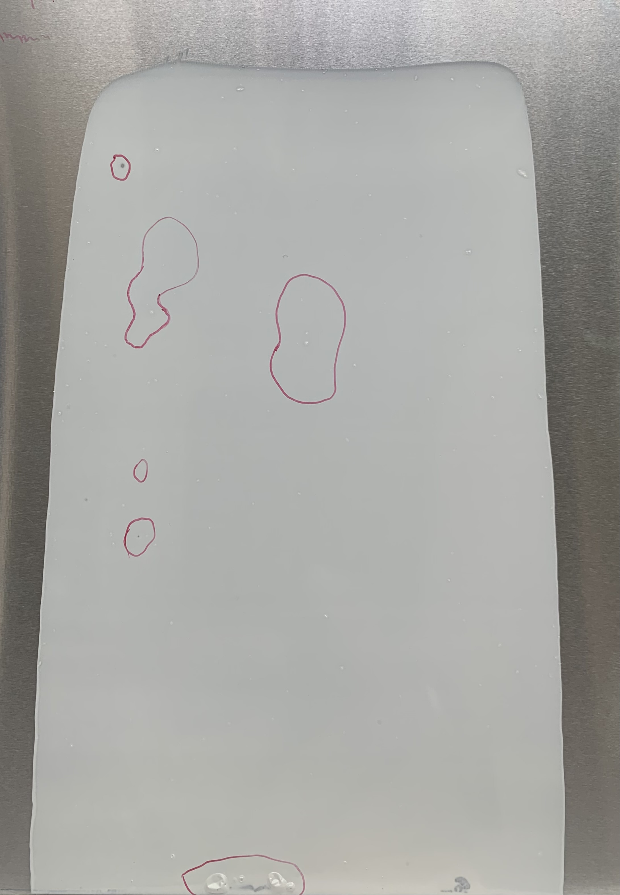
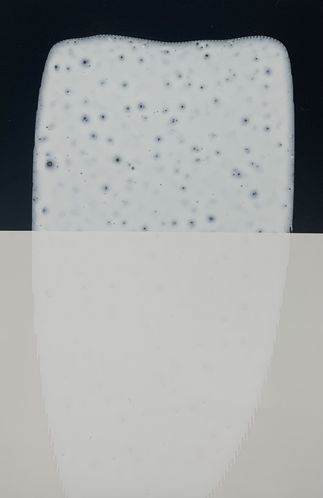
  </p>
<figcaption align = "center"><b>Fig.1 Example of the solvent- and water-borne drawdowns</b>
</figcaption>


The water- and solvent-borne (WB and SB for simplicity) drawdowns are prepared on different substrates - paper charts or glass plates for WB and metallic plates for SB. Such differences also affect the film appearance. For WB drawdowns, it is fairly straighforward to see crators, flow and levelling defects and other surface defects. For the SB drawdowns, one has to carefully analyze the film's surface... 

Flow, wetting, crators 

## Algorithm

The algorith for the analysis is based on image processing techniques. Because the defects on SB and WB plates are presented differently (WB - readily visible crators; SB - marked regions), we should take into account when setting up the algorithm.

<p align="center">


  </p>
<figcaption align = "center"><b>Fig.1 Example of the solvent- and water-borne drawdowns</b>
</figcaption>

text here

<p align="center">
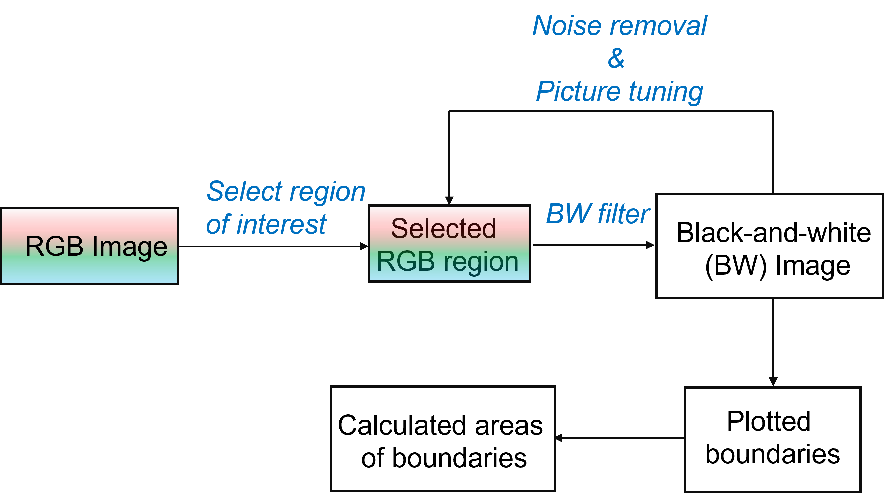
  </p>
<figcaption align = "center"><b>Fig.1 Example of the solvent- and water-borne drawdowns</b>
</figcaption>

WB - two colored charts
SB - circle the defects using a marker.

(figure of the marked SB drawdown)

## App

The app's interface:
<p align="center">
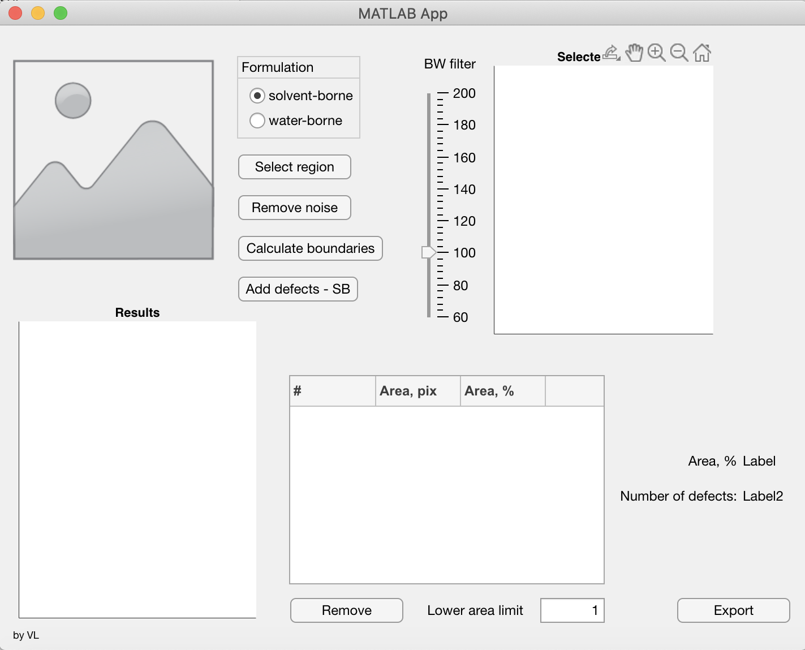
  </p>
<figcaption align = "center"> 
  <b>Fig.2 Example of the solvent- and water-borne drawdowns</b>
</figcaption>

## Code

To upload the image, one has to click on the image UI component. Three empty arrays, which are going to be used later on, are initilized. It is not critical to initialize them at this stage, but I wanted to make sure that I would not forget to do it later. When the image is uploaded, it appears in the same UI image icon that you clicked on.

```Matlab
% Image clicked function: Image
        function ImageClicked(app, event)
            global img;
            global defect_area_perc_list;
            global defect_area_pix_list;
            global numerated_defects_list;

            defect_area_perc_list = [];
            defect_area_pix_list = [];
            numerated_defects_list = [];

            [a,b] = uigetfile({'*.*'});
            if isequal(a, 0);
                disp("No image selected");
            else
                img = imread([b,a]);
                app.Image.ImageSource = img;
            end
        end

```
To switch between different algorithms (and parameters) for SB and WB drawdowns, I added a app.ButtonGroup. It reads up a type of used formulation (solvent-borne or water-borne) and stores it under the variable "buttonText". 

```Matlab
% Selection changed function: FormulationButtonGroup
        function FormulationButtonGroupSelectionChanged(app, event)
            global buttonText;
            selectedButton = app.FormulationButtonGroup.SelectedObject;
            buttonText = selectedButton.Text
        end
```

It is seldomly the whole uploaded picture that is going to be analyzed. In most cases, it is only a specific region that is of interest. The "Select region"-button was introduced so that user could select the region of interest (ROI) him/herself. ROI was selected using a *drawrectangle* function. After the rectangle has been placed, it's position was readed and the uploaded image was then croped with the constrains that the ROI implied.  

```Matlab
% Button pushed function: SelectregionButton
        function SelectregionButtonPushed(app, event)
            global img;
            global img_croped;
            global low_area_limit;

            figure, imshow(img);
            % Clears the content of the table
            app.UITable.Data = [];
            roi = drawrectangle('Color','b'); % draw the rectangle
                if isvalid(roi);
                    pos = roi.Position;
                    img_croped = imcrop(img, pos);
                    imshow(img_croped, "parent", app.UIAxes_ROI);  
                    close % close the image after selection
                else
                    disp("Cancelled");
                end

             if isequal(low_area_limit, true);
                 disp("PUESHED")

             else
                 disp('NOT pushed')
                 low_area_limit = 1;
             end
```

To further analyze the croped region form the previous step, it has to be converted to the black-and-white (BW) image. Here I though to take down two flies on one smack - convert ot BW, smooth the edges of the defects and filter off the noisy pixels. Since the selected region is still a RGB image, it must be converted to the gray-scale image using an *rgb2gray* function. The contrast of the gray-scale image was enhanced by means of *adapthisteq* and *imadjust* functions. 
The convertation to the BW image is fairly simple and was achieved by threshholding the intensity of the gray image using *changingValue*-variable. This variable was being read from the sliding bar. So by manually changing the sliding bar value, the "depth" of BW image can be scanned, revealing more or less defects depending on the needs.  

<p align="center">
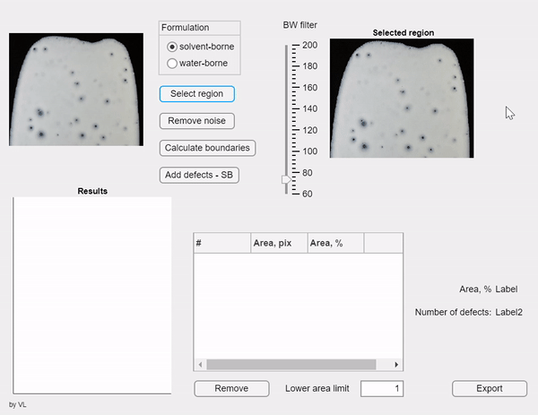
  </p>
<figcaption align = "center"> 
  <b>Fig.2 Example of the solvent- and water-borne drawdowns</b>
</figcaption>

Function *bwareaopen* smoothes the edges around the defects so they do not look sharp. The rest of the code plots the BW figure into the UIAxis. 

```Matlab
% Value changing function: BWfilterSlider
        function BWfilterSliderValueChanging(app, event)
            global changingValue;
            global img_croped;
            global img_cr_bw;
            
          % Reads up the value from the slider
            changingValue = event.Value;
            img_gray = rgb2gray(img_croped);
            claheI = adapthisteq(img_gray,'ClipLimit',0.01);
            claheI = imadjust(claheI);

            img_cr_bw = claheI > changingValue; % change this number to change the sensitivity
            se = strel('disk', 4); % change to change the sensitivity
            img_cr_bw = imopen(img_cr_bw, se);
            % Noise removal
            img_cr_bw = bwareaopen(img_cr_bw, 60);  
            imshow(img_cr_bw, "parent", app.UIAxes_ROI);
        end
```
Example
<p align="center">
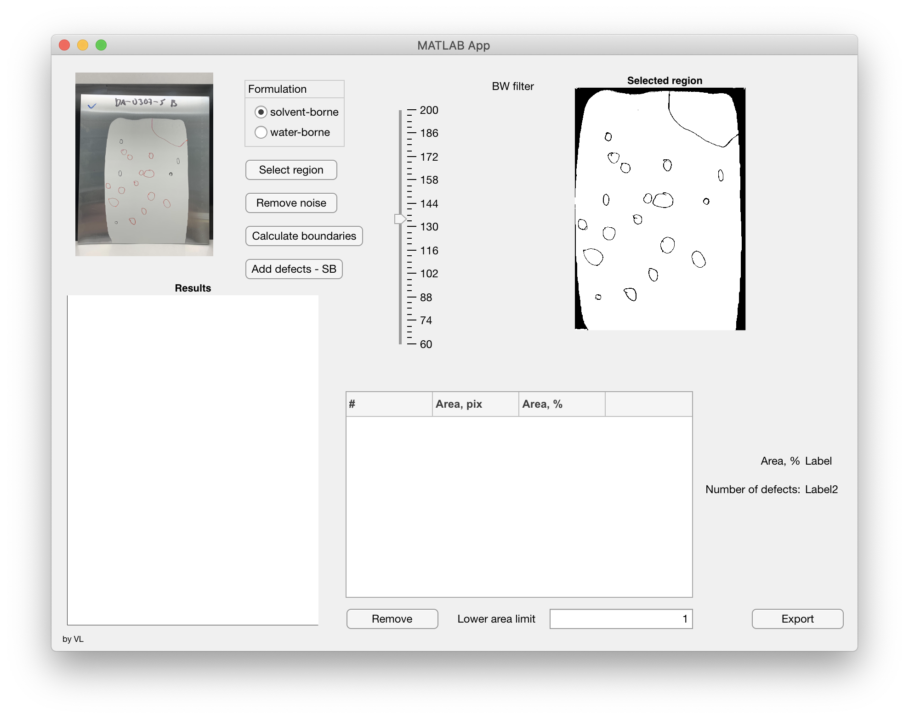
  </p>
<figcaption align = "center"> 
  <b>Fig.2 Example of the solvent- and water-borne drawdowns</b>
</figcaption>

example 2

Boundaries calculations
When the defects are represented as BW image, we can draw the borders on the interface between white and black pixels. That would give us coordinates of each boundary associated with defects, which then could be converted to the area. The calculated area of each defect would then be divided on the area of the whole drawdown (or the selected region of interest), stored in the list as pixel and percentage area. The sum of area of each individual defect would give us then a total defectiveness of the drawdown, in percentage.

Single defect, % = defect's area (pix^2) / total area * 100

So the first thing that has to be done is to calculate the area of the whole drawdown or the selected region. This is done using the *bwarea* function that calculates the area in the binary image (the "white" part in the BW image). But before we apply this function, we have to make sure that the defects are filled (in the BW image the defects are "black") and became "white". That would ensure that the defects are gone and the total area would be calculated as the "undefected" one. This is illustrated in the figures below:

Example
<p align="center">
<kbd>
  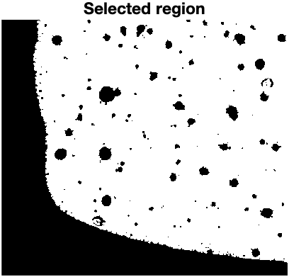
  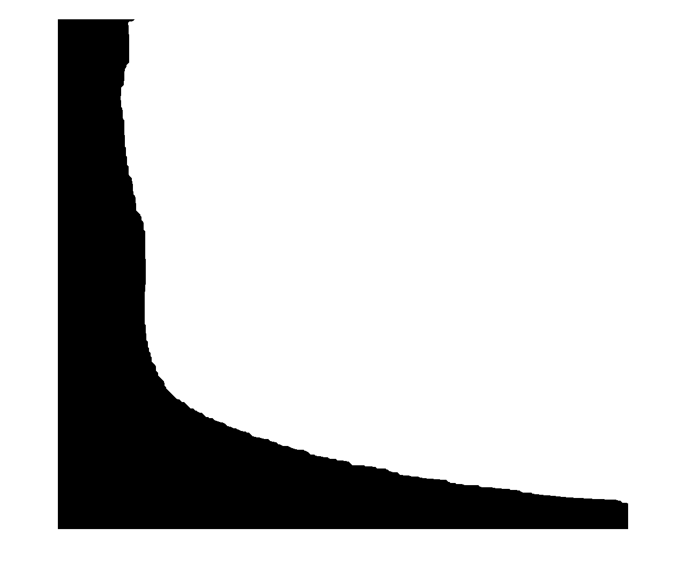
</kbd>
  </p>
<figcaption align = "center"> 
  <b>Fig.2 Example of the solvent- and water-borne drawdowns</b>
</figcaption>

To the left is a selected BW region that will be used for plotting the boundaries and to the right - the "non-defected" area, where the defects are filled with "white" pixels. The defects were filled using *strel* and *imclose* functions.
The boundaries are traced using the *bwboundaries*-function, which takes in a BW image and outputs a list of found boundaries. The first for-loop creates lists of numbered defects (1,2,3...), boundaries (new_B_list), and areas in pixels and percentage. The second for-loop plots the boundaries with their corresponding numbers on the analyzed figure. There is a variable called *low_area_limit*, which is involved in the if-loop and will be discussed later.

Finally, values from three created lists (numerated_defects_list, defect_area_pix_list, defect_area_perc_list) are used to create an UITable as well as update the text labels with the total sum of the defected area and number of defects.  

The complete code for the "Calculate"-button is attached below.

```Matlab
% Button pushed function: CalculateboundariesButton
        function CalculateboundariesButtonPushed(app, event)
            global img_cr_bw;
            global k_numbers_list;  
            global numerated_defects_list;
            global defect_area_perc_list;
            global buttonText;
            global img_temp;
            global new_B_list;
            global low_area_limit;
            global defect_area_pix_list;
        
            defect_area_perc_list = [];
            defect_area_pix_list = [];
            numerated_defects_list = [];

            app.UITable.Data = [];
            disp(low_area_limit)
            % Calculate the area of the whole drawdown. The defects are
            % filled.
            se = strel("disk", 50);
            bw_4area = imclose(img_cr_bw, se);
            figure, imshow(bw_4area);
            drawdown_area = bwarea(bw_4area);
     %       figure, imshow(img_cr_bw);

            % Boundaries calculation
            disp(buttonText)
            if isequal(buttonText, 'water-borne');
                formulation = 'holes'
            else
                formulation = 'noholes'
            end
            disp(formulation)

            [B,L] = bwboundaries(img_cr_bw, formulation);
            img_temp = label2rgb(L, @jet, [.0 .0 .0]);
            imshow(img_temp);
            hold on
            k_numbers_list = {}; % create an empty list of numbers of boundaries to be used in BoxList. 
      
            all_defects_area_pix = 0;
        
            m = 0;
            new_B_list = [];

            for i = 1:length(B);
                defect = B{i};
                x = defect(:,2);
                y = defect(:,1);
                defect_area_pix = polyarea(x,y);
                if defect_area_pix > low_area_limit;
                    m = m + 1;
                    defect_area_pix_list(end+1) = defect_area_pix;
                    defect_area_perc = defect_area_pix / drawdown_area * 100;
                    defect_area_perc_list(end+1) = defect_area_perc;
                    all_defects_area_pix = all_defects_area_pix + defect_area_pix;
                    numerated_defects_list(end+1) = string(m);
                    %defect = B{m};
                    new_B_list{end+1} = defect;
                end
            end

            for k = 1:length(new_B_list);
                boundary = new_B_list{k};
                x = boundary(:, 2);     
                y = boundary(:, 1);
                plot(x, y, 'w', 'LineWidth', 3)
                text(x(1), y(1), string(k), 'Color','r','FontSize',20);
                k_numbers_list{end+1} = k;
                disp(new_B_list{k})
                disp(k_numbers_list{k})
            end
            disp(k_numbers_list)
            imshow(img_temp, "parent", app.UIAxes2);

            app.UITable.ColumnName = {'Number', 'Area, PIX','Area, %'}
            app.UITable.ColumnWidth = {'auto'};
            app.UITable.FontSize = 10;
            for k = 1:length(numerated_defects_list);
                app.UITable.Data = [app.UITable.Data; numerated_defects_list(k), defect_area_pix_list(k), defect_area_perc_list(k)];
            end

            defected_area_perc = sum(defect_area_perc_list);
            % Display the calculated area
            app.LabelArea.Text = string(round(defected_area_perc, 4));

            % Update the number of defects label
            app.Label2.Text = string(length(numerated_defects_list));
        end
```
After the "Calculate boundaries"-button has been pressed, an image with plotted defects and their numbers appears:

<p align="center">
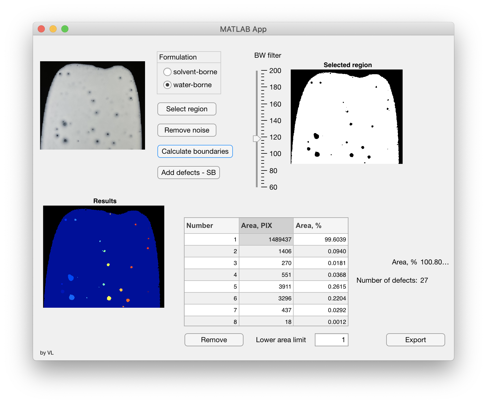
  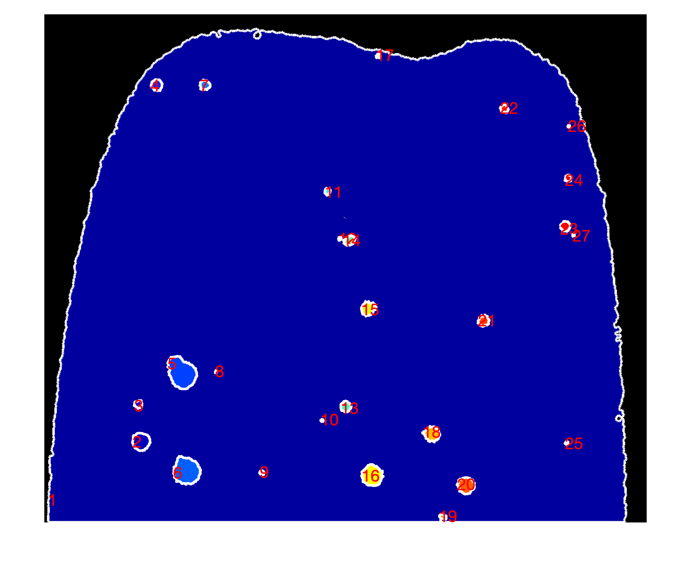
  </p>
<figcaption align = "center"> 
  <b>Fig.2 Example of the solvent- and water-borne drawdowns</b>
</figcaption>

All in all there was found 27 defects, which were numerated, areas calculated and plotted into the table. As it can be seem from the picture, the drawdown area was also recognized as a defect, which is obviously not the case. Its calculated area of almost 99.6 % contributed to the overall sum of defects which is above 100%. This means that we should exclude this "defect" from the defect list, update calculations and table, and plot the results again. 

To do so, the button "Remove" was created with the following code:
```Matlab
 % Button pushed function: RemoveButton
        function RemoveButtonPushed(app, event)
            global selectedRow;
            global numerated_defects_list;
            global defect_area_perc_list;
            global img_temp;
            global new_B_list;
            
            numerated_defects_list(selectedRow) = [];
            defect_area_perc_list(selectedRow) = [];
            new_B_list(selectedRow) = [];
      
            if isequal(height(selectedRow), 1) 
                    % If the height of event.Indices is one, it means a single row
                    % is selected and we can remove it, if you want to
                    % remove more rows, you can implement it easily
                    
                if selectedRow > height(app.UITable.Data) % When the last row is clicked and removed, subsequent 
                   selectedRow = height(app.UITable.Data);  % removing will throw an error, remove last row instead
                end
                app.UITable.Data(selectedRow, :) = [];
            end

            defected_area_perc_excluded = sum(defect_area_perc_list);
            % Display a calculated area
            app.LabelArea.Text = string(round(defected_area_perc_excluded,2));

            imshow(img_temp);
            hold on
            for i = 1:length(new_B_list);
           % for i = numerated_defects_list;
                boundary = new_B_list{i};
                x = boundary(:, 2);     
                y = boundary(:, 1);
                plot(x, y, 'w', 'LineWidth', 3)
                text(x(1), y(1), string(numerated_defects_list(i)), 'Color','r','FontSize',20);
                i = i + 1;
            end

            % Update the number of defects label
            app.Label2.Text = string(length(numerated_defects_list));
        end
```
In order to remove a defect one can just click on any place in the raw of the defect to be removed and click the "Remove"-button. The values from the lists (areas in pixels and percentage) will be removed from the lists and plotted in the table. After the "reference" defect has been removed (the one corresponding to the whole drawdown area) the new values are updated are the total defected area is 0.84% with 23 defects. The interaction with table's content is achieved using the following callback code: 

```Matlab
% Cell selection callback: UITable
        function UITableCellSelection(app, event)
            global selectedRow;
            selectedRow = event.Indices(1);
        end
```

And the code for the "Remove"-button:

```Matlab
% Button pushed function: RemoveButton
        function RemoveButtonPushed(app, event)
            global selectedRow;
            global numerated_defects_list;
            global defect_area_perc_list;
            global img_temp;
            global new_B_list;
            
            numerated_defects_list(selectedRow) = [];
            defect_area_perc_list(selectedRow) = [];
            new_B_list(selectedRow) = [];
      
            if isequal(height(selectedRow), 1) 
                    % If the height of event.Indices is one, it means a single row
                    % is selected and we can remove it, if you want to
                    % remove more rows, you can implement it easily
                    
                if selectedRow > height(app.UITable.Data) % When the last row is clicked and removed, subsequent 
                   selectedRow = height(app.UITable.Data);  % removing will throw an error, remove last row instead
                end
                app.UITable.Data(selectedRow, :) = [];
            end

            defected_area_perc_excluded = sum(defect_area_perc_list);
            % Display a calculated area
            app.LabelArea.Text = string(round(defected_area_perc_excluded,2));

            imshow(img_temp);
            hold on
            for i = 1:length(new_B_list);
                boundary = new_B_list{i};
                x = boundary(:, 2);     
                y = boundary(:, 1);
                plot(x, y, 'w', 'LineWidth', 3)
                text(x(1), y(1), string(numerated_defects_list(i)), 'Color','r','FontSize',20);
                i = i + 1;
            end

            % Update the number of defects label
            app.Label2.Text = string(length(numerated_defects_list));
        end
 ```
The defect list can be filtered after the defects area in pixels. This would remove the defects with areas below the threshold.

<p align="center">
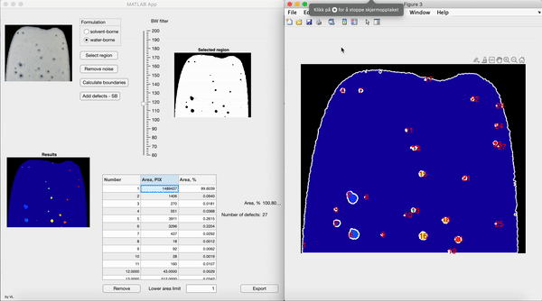
  </p>
<figcaption align = "center"> 
  <b>Fig.2 Example of the solvent- and water-borne drawdowns</b>
</figcaption>

## Supplementary functionality

### Remove the undesired noise/areas

Sometimes, the software draws the boundaries around the objects that are not relevant for the analysis. It could also be that the light environment was not perfect and some parts of the image are overexposed. In all these cases, it could be complicated to achieve a good contrast when obtaining the BW-image. For these cases, a "Remove noise"-button can be used. This button allows to place black rectangles on the image part that is hard to adjust or undesirable in the analysis.
```Matlab
 % Button pushed function: RemovenoiseButton
        function RemovenoiseButtonPushed(app, event)

            global img_croped;
            global img_cr_bw;
            global changingValue;
            global img_gray;
 
            app.UITable.Data = [];

            % Display the selected region and selec the region to mask
            imshow(img_cr_bw);
            message = sprintf('Left click and hold to begin drawing.\nSimply lift the mouse button to finish');
            uiwait(msgbox(message));
            
            hFH = drawrectangle();
            % Create a binary image ("mask") from the ROI object.
            binaryImage = hFH.createMask();
            
            % This part puts the black drawn square on the cropped BW image
            % Convert from RGB to gray.
            rgbImage = rgb2gray(img_croped);
      
            redChannel = rgbImage(:, :, 1);
            greenChannel = rgbImage(:, :, 1);
            blueChannel = rgbImage(:, :, 1);
            desiredColor = [0, 0, 0];
            redChannel(binaryImage) = desiredColor(1);
            greenChannel(binaryImage) = desiredColor(2);
            blueChannel(binaryImage) = desiredColor(3);
            rgbImage = cat(3, redChannel, greenChannel, blueChannel);
            img_gray = rgb2gray(rgbImage);
            img_cr_bw = im2bw(img_gray);
            imshow(img_cr_bw, "parent", app.UIAxes_ROI);
       
            answer = questdlg('Remove more?', ...
	        'Remover', ...
	        'Yes','No','No');
            
            % Handle response
            switch answer
                case 'Yes'
                    while true;
                        message = sprintf('Left click and hold to begin drawing.\nSimply lift the mouse button to finish');
                        uiwait(msgbox(message));
                        hFH = drawrectangle(); % imfreehand
                        % Create a binary image ("mask") from the ROI object.
                        binaryImage = hFH.createMask();

                        redChannel = rgbImage(:, :, 1);
                        greenChannel = rgbImage(:, :, 1);
                        blueChannel = rgbImage(:, :, 1);
                        desiredColor = [0, 0, 0];
                        redChannel(binaryImage) = desiredColor(1);
                        greenChannel(binaryImage) = desiredColor(2);
                        blueChannel(binaryImage) = desiredColor(3);
                        rgbImage = cat(3, redChannel, greenChannel, blueChannel);
                        img_gray = rgb2gray(rgbImage);
             
                        figure, imshow(img_gray); 
                   
                        close(1);
                        answer = questdlg('Remove more?', ...
	                    'Remover', ...
	                    'Yes','No','No');
                        switch answer
                            case "No"
                                imshow(img_gray, "parent", app.UIAxes_ROI);
                                break
                            case "Yes"
                        end
                    end
                case 'No'
                    imshow(img_gray, "parent", app.UIAxes_ROI);    
            end
        end
```
### Filter the defects' areas

In some cases, when the amount of defect is large, then it could be usefull to filter off the defects whith area lower than the treshold. The treshold is set manually in the label field. It is stored in the variable *low_area_limit* and passed to the if-loop when the "Calculate boundaries"-button has been pressed.

```Matlab
 % Value changed function: LowerarealimitEditField
        function LowerarealimitEditFieldValueChanged(app, event)
            global low_area_limit;
            low_area_limit = app.LowerarealimitEditField.Value;
            % Clears the content of the table
            app.UITable.Data = [];
            app.CalculateboundariesButtonPushed
        end
```

### Manual addition of the defected area.

In cases where the above mentioned aglorithm fails to recognize the defect, it could be usefull to manually sircle the defected area. Directly on the image. This is demonstrated in the figure below. First, the total area of the drawdonw (or the region of interest) should be chosen. Then, the defects can be circled manually by drawing the rectangles on the image.
The table will be updated with the newly highlighted defects and their corresponding areas.

```Matlab
  global img_croped;
            global img;
            global img_cr_bw;
            global indiv_area;
            global values_B;
            
            defect_area_perc_list = [];
            defect_area_pix_list = [];
            numerated_defects_list = [];
            defected_are_percentage = [];
            app.UITable.Data = [];
            added_crators_area = 0;
   
            figure, imshow(img_croped);
            answer = questdlg('Select the drawdown area', ...
	        'Add defect', ...
	        'Ok','Done','Done');
            hFH = drawpolygon('Color','g');
            drawdown_pos = hFH.Position;
            hold on
            x = drawdown_pos(:, 1);
            y = drawdown_pos(:, 2);
            plot(x, y, 'w', 'LineWidth', 2);
            drawdown_area_manual_pix = polyarea(x,y);
            
            % Handle response
            switch answer
                case 'Ok'
                    k = 1;
                    while true;
                        message = sprintf('Select the defects.');
                        uiwait(msgbox(message));
                        hFH = drawpolygon('Color','b');
                        defect_pos = hFH.Position;
                        hold on
                        x = defect_pos(:, 1);
                        y = defect_pos(:, 2);
                        plot(x, y, 'w', 'LineWidth', 2);
                        defect_area_manual_pix = polyarea(x,y);

                        defect_area_pix_list(end+1) = defect_area_manual_pix;
                        defect_area_manual_perc = defect_area_manual_pix / drawdown_area_manual_pix * 100;
                        defect_area_perc_list(end+1) = defect_area_manual_perc
                        numerated_defects_list(end+1) = k
                        k = k + 1

                        answer = questdlg('Add more defects?', ...
	                    'Add defects', ...
	                    'Yes','No','No');

                        switch answer
                            case "No"
                                app.LabelArea.Text = string(sum(defect_area_perc_list));
                                app.Label2.Text = string(length(numerated_defects_list));
                                imshow(img_croped, "parent", app.UIAxes2);
                                app.UITable.ColumnName = {'Number', 'Area, PIX','Area, %'}
                                app.UITable.ColumnWidth = {'auto'};
                                app.UITable.FontSize = 10;
                                for k = 1:length(numerated_defects_list);
                                    app.UITable.Data = [app.UITable.Data; numerated_defects_list(k), defect_area_pix_list(k), defect_area_perc_list(k)];
                                end
                                break
                            case "Yes"
                        end
                    end
                case 'No'
                    imshow(img_croped, "parent", app.UIAxes2);
            end 
        end
```
### Export to Excel

Finally, tha data from the table can be exported to a .txt or Excel file by clicking on the "Export"-button.
```Matlab
   % Button pushed function: ExportButton
        function ExportButtonPushed(app, event)
            global img_cr_bw;
            global numerated_defects_list;
            headers = {'Number','Area (pixels)','Area (%)'}
            [filename,pathname]= uiputfile('*.xls','Save as');
         
            tableData = app.UITable.Data;
            eXcelTable = [headers; num2cell(tableData)];
            place_to_save = string(pathname) + string(filename)
    
            newTable = table({'a', 'b' , 10})
            writecell(eXcelTable, place_to_save);
        end
```
